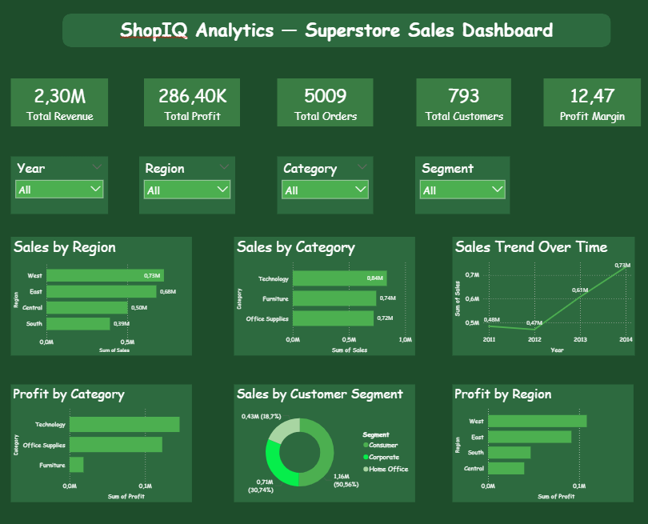

# 🛒 E-Commerce Sales Analysis — Superstore Dashboard

## 🏢 Business Context
**Company:** ShopIQ Analytics  
**Client:** US Superstore Chain  
**Role:** Data Analyst

> "We need to understand our sales performance — which products 
> sell the most, which regions generate the most revenue, and 
> where are we losing money. The CEO needs this for Friday"

---

## 📋 Project Overview
This project analyzes 4 years of sales data (2011-2014) from a US 
Superstore with 9,994 transactions across 4 regions, 3 product 
categories and 793 customers.

---

## 🔍 Key Business Questions
- Which region generates the most revenue and profit?
- Which product categories are most profitable?
- How have sales trended over time?
- Which products and states are losing money?
- What is the impact of discounts on profit?
- Which customer segment is most valuable?

---

## 💡 Key Findings & Recommendations

| Finding | Recommendation |
|---------|---------------|
| West region leads with $0.73M in sales | Increase investment in West |
| Furniture has only $18K profit from $740K sales | Review Furniture pricing strategy |
| Tables sub-category losing $18,000+ | Stop high discounts on Tables |
| Texas losing $25,729 despite $170K sales | Investigate discount policy in Texas |
| Discounts above 30% always cause losses | Cap discounts at 20% maximum |
| Sales grew 51% from 2011 to 2014 | Maintain growth momentum |

---

## 🛠️ Tools Used
| Tool | Purpose |
|------|---------|
| Python (Pandas) | Data cleaning and exploration |
| SQL (SQLite) | Business queries and analysis |
| Matplotlib & Seaborn | Data visualization |
| Power BI | Interactive business dashboard |

---

## 📊 Dashboard Preview


---

## 📁 Project Structure

```
ecommerce-analysis-project/
│
├── Superstore Sales.csv              # Original dataset from Kaggle
├── analysis.ipynb                    # Python notebook with full analysis
├── clean_superstore_data.csv         # Cleaned dataset
├── superstore.db                     # SQLite database
├── superstore-sales-dashboard.pbix   # Power BI dashboard
├── dashboard_screenshot.png          # Dashboard preview
├── chart1_sales_profit_by_region.png
├── chart2_sales_profit_by_category.png
├── chart3_sales_trend.png
├── chart4_profit_by_subcategory.png
├── chart5_segment_analysis.png
├── chart6_discount_vs_profit.png
├── chart7_yearly_performance.png
├── chart8_loss_making_states.png
└── README.md
```

---

## 📈 Key Metrics
- **Total Revenue:** $2,297,200
- **Total Profit:** $286,397
- **Profit Margin:** 12.47%
- **Total Orders:** 5,009
- **Total Customers:** 793
- **Period:** 2011 - 2014

---

## 🗄️ SQL Analysis
- Top 10 most profitable products
- Top 10 loss making products
- Yearly sales and profit performance
- Most and least profitable states

---

## 📚 Dataset
- **Source:** [Kaggle - Superstore Sales](https://www.kaggle.com/datasets/ishanshrivastava28/superstore-sales)
- **Author:** Ishan Shrivastava
- **Period:** 2011 - 2014
- **Records:** 9,994 transactions
- **Features:** 21 columns

---

## 👩‍💻 Author
**Ouided Boulkroune**
Information Systems Engineer | Data Analyst | Data-Driven Decision Making

📧 ouided.bk.analyst@gmail.com
🔗 www.linkedin.com/in/ouided-boulkroune